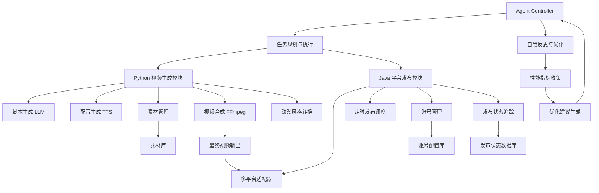

# 动漫短视频智能生产系统架构设计

## 1. 系统架构图



## 2. 技术栈选型

### Python 视频生成模块
- **核心语言**: Python 3.9+
- **LLM 集成**: OpenAI API / Claude API / 本地 LLM (Ollama)
- **TTS 引擎**: ElevenLabs API / Azure TTS / 本地 TTS (Coqui TTS)
- **素材管理**: SQLite + 文件系统 / MongoDB (可选)
- **视频处理**: FFmpeg + MoviePy / OpenCV
- **动漫风格转换**: Stable Diffusion + ControlNet / AnimeGAN
- **异步处理**: Celery + Redis / asyncio
- **API 框架**: FastAPI / Flask

### Java 平台发布模块
- **核心语言**: Java 17+
- **Web 框架**: Spring Boot 3.x
- **HTTP 客户端**: OkHttp / Apache HttpClient
- **调度框架**: Quartz Scheduler / Spring Scheduler
- **数据存储**: PostgreSQL / MySQL
- **缓存**: Redis
- **消息队列**: RabbitMQ / Kafka (可选，用于解耦)
- **配置管理**: Spring Cloud Config / Apollo

### Agent 层
- **Agent 框架**: 自研 ReAct 模式实现
- **规划引擎**: 基于 LLM 的任务分解
- **工具调用**: Function Calling / Tool Use
- **记忆机制**: 向量数据库 (ChromaDB / Pinecone)
- **反思机制**: LLM 自我评估 + 规则引擎

### 基础设施
- **容器化**: Docker + Docker Compose
- **编排**: Kubernetes (生产环境可选)
- **监控**: Prometheus + Grafana
- **日志**: ELK Stack / Loki + Grafana
- **CI/CD**: GitHub Actions / GitLab CI

## 3. 模块划分

### 3.1 Agent Controller (核心协调层)
- **任务接收**: 接收用户输入的视频创作需求
- **任务规划**: 将复杂任务分解为原子操作
- **执行协调**: 调用 Python 和 Java 模块的相应功能
- **状态跟踪**: 监控整个生产流程的状态
- **异常处理**: 处理各模块的错误和重试逻辑
- **反思优化**: 基于历史执行结果优化未来决策

### 3.2 Python 视频生成模块

#### 3.2.1 Script Generator (脚本生成)
- **输入**: 用户需求描述、主题、风格偏好
- **处理**: 调用 LLM 生成视频脚本（包含场景、对话、动作描述）
- **输出**: 结构化脚本文档（JSON/YAML 格式）

#### 3.2.2 Voice Synthesis (配音生成)
- **输入**: 脚本中的对话文本、角色信息
- **处理**: 调用 TTS 服务生成对应语音文件
- **输出**: 音频文件（WAV/MP3 格式）

#### 3.2.3 Asset Manager (素材管理)
- **素材库**: 图片、视频片段、背景音乐、音效
- **素材检索**: 基于标签和语义搜索
- **素材下载**: 从外部资源自动下载所需素材
- **素材缓存**: 本地缓存常用素材提高效率

#### 3.2.4 Video Composer (视频合成)
- **输入**: 脚本、音频文件、素材文件
- **处理**: 使用 FFmpeg 进行视频剪辑、合成、转场效果
- **输出**: 初步合成的视频文件

#### 3.2.5 Anime Style Transfer (动漫风格转换)
- **输入**: 合成后的视频帧
- **处理**: 应用动漫风格转换模型
- **输出**: 具有动漫风格的最终视频

### 3.3 Java 平台发布模块

#### 3.3.1 Platform Adapters (多平台适配器)
- **抖音适配器**: 处理抖音 API 认证和发布
- **B站适配器**: 处理 Bilibili API 认证和发布
- **快手适配器**: 处理快手 API 认证和发布
- **小红书适配器**: 处理小红书 API 认证和发布
- **通用接口**: 统一的发布接口，屏蔽平台差异

#### 3.3.2 Scheduling Service (定时发布调度)
- **时间管理**: 支持指定发布时间或时间段
- **队列管理**: 管理待发布的视频队列
- **优先级控制**: 支持不同优先级的发布任务

#### 3.3.3 Account Manager (账号管理)
- **账号存储**: 安全存储各平台账号信息
- **权限管理**: 管理账号的发布权限
- **多账号支持**: 支持同一平台多个账号

#### 3.3.4 Status Tracker (发布状态追踪)
- **状态记录**: 记录每个视频的发布状态
- **失败重试**: 自动重试失败的发布任务
- **状态查询**: 提供发布状态查询接口

## 4. 接口设计

### 4.1 Agent 与 Python 模块接口

#### 视频生成请求接口
```
POST /api/v1/video/generate
Content-Type: application/json

{
  "task_id": "unique-task-id",
  "script_prompt": "视频主题和要求描述",
  "style_preference": "anime_style_v1",
  "duration_target": 60,
  "voice_settings": {
    "language": "zh-CN",
    "voice_type": "female_youthful"
  }
}
```

#### 视频生成状态查询接口
```
GET /api/v1/video/status/{task_id}
```

#### 视频生成结果回调接口
```
POST /api/v1/agent/callback/video-complete
Content-Type: application/json

{
  "task_id": "unique-task-id",
  "video_path": "/path/to/generated/video.mp4",
  "status": "success|failed",
  "error_message": "optional error details"
}
```

### 4.2 Agent 与 Java 模块接口

#### 视频发布请求接口
```
POST /api/v1/publish/schedule
Content-Type: application/json

{
  "task_id": "unique-task-id",
  "video_path": "/path/to/video.mp4",
  "platforms": ["douyin", "bilibili", "kuaishou", "xiaohongshu"],
  "publish_time": "2026-03-23T10:00:00+08:00",
  "title": "视频标题",
  "description": "视频描述",
  "tags": ["动漫", "AI生成"]
}
```

#### 发布状态查询接口
```
GET /api/v1/publish/status/{task_id}
```

#### 发布结果回调接口
```
POST /api/v1/agent/callback/publish-complete
Content-Type: application/json

{
  "task_id": "unique-task-id",
  "platform_results": [
    {
      "platform": "douyin",
      "status": "success|failed",
      "post_url": "https://www.douyin.com/video/123456",
      "error_message": ""
    }
  ]
}
```

### 4.3 内部模块间接口

#### Python 模块内部接口
- **ScriptGenerator → VoiceSynthesis**: 传递脚本中的对话文本
- **AssetManager → VideoComposer**: 提供素材文件路径
- **VoiceSynthesis → VideoComposer**: 提供音频文件路径

#### Java 模块内部接口
- **SchedulingService → PlatformAdapters**: 触发实际发布操作
- **AccountManager → PlatformAdapters**: 提供认证信息
- **StatusTracker → All Components**: 记录各阶段状态

## 5. 数据流设计

### 5.1 视频生成数据流

1. **用户输入** → Agent Controller
2. Agent Controller → Script Generator (脚本生成请求)
3. Script Generator → LLM API (获取脚本内容)
4. Script Generator → Voice Synthesis (传递对话文本)
5. Script Generator → Asset Manager (请求相关素材)
6. Voice Synthesis → TTS API (生成语音)
7. Asset Manager → 外部资源/本地库 (获取素材)
8. Voice Synthesis + Asset Manager → Video Composer (提供音频和素材)
9. Video Composer → FFmpeg (视频合成)
10. Video Composer → Anime Style Transfer (风格转换请求)
11. Anime Style Transfer → Stable Diffusion (风格转换)
12. Anime Style Transfer → Video Composer (返回风格化帧)
13. Video Composer → 最终视频文件
14. 最终视频文件 → Agent Controller (完成通知)

### 5.2 平台发布数据流

1. Agent Controller → Java 发布模块 (发布请求)
2. Java 发布模块 → Account Manager (获取账号信息)
3. Java 发布模块 → Scheduling Service (安排发布时间)
4. Scheduling Service → Platform Adapters (触发发布)
5. Platform Adapters → 各平台 API (实际发布)
6. Platform Adapters → Status Tracker (记录发布状态)
7. Status Tracker → Agent Controller (发布结果通知)

### 5.3 Agent 反思优化数据流

1. 所有模块 → Performance Metrics Collector (收集性能指标)
2. Performance Metrics Collector → Agent Controller (汇总数据)
3. Agent Controller → LLM (生成优化建议)
4. LLM → Agent Controller (返回优化策略)
5. Agent Controller → 更新内部策略和参数

## 6. Agent 设计

### 6.1 ReAct 模式实现

基于 Simple BI Agent 的 ReAct 架构，我们的 Agent 实现包含以下核心组件：

#### Thought (思考)
- 分析用户需求的复杂性和可行性
- 识别需要调用的工具和模块
- 评估潜在的风险和约束条件

#### Action (行动)
- 调用具体的工具函数（Python/Java 模块）
- 执行原子化的操作步骤
- 处理同步和异步操作的差异

#### Observation (观察)
- 接收工具执行的结果
- 验证结果的正确性和完整性
- 识别执行过程中的异常情况

#### Reflection (反思)
- 评估整个任务执行的效果
- 识别可以改进的环节
- 更新内部的知识库和策略

### 6.2 任务规划与执行

#### 分层任务规划
- **高层规划**: 将用户需求分解为主要阶段（脚本→配音→合成→发布）
- **中层规划**: 将每个阶段分解为具体任务（如脚本生成包含场景设计、对话编写等）
- **底层执行**: 调用具体的工具函数执行原子操作

#### 动态调整机制
- **条件分支**: 根据中间结果动态调整后续步骤
- **错误恢复**: 在失败时尝试替代方案或降级处理
- **资源优化**: 根据系统负载动态调整并行度和优先级

### 6.3 自我反思与优化

#### 性能指标收集
- **成功率**: 各阶段任务的成功率统计
- **耗时分析**: 各步骤的执行时间分布
- **资源消耗**: CPU、内存、网络等资源使用情况
- **用户满意度**: 基于用户反馈的质量评估

#### 优化策略生成
- **参数调优**: 自动调整 LLM 温度、TTS 语速等参数
- **流程优化**: 识别瓶颈环节并提出改进建议
- **工具选择**: 根据任务特点选择最优的工具组合
- **缓存策略**: 优化素材和中间结果的缓存机制

#### 知识库更新
- **经验积累**: 将成功的执行模式保存为模板
- **错误模式**: 记录常见错误及其解决方案
- **最佳实践**: 持续更新各领域的最佳实践

## 7. 分阶段实施计划（螺旋上升）

### 阶段 1: MVP (最小可用产品) - 2周

**目标**: 实现基本的视频生成和单平台发布能力

**功能范围**:
- 简单脚本生成（固定模板 + LLM 填充）
- 基础 TTS 配音（单一语音）
- 本地素材库（预置素材）
- FFmpeg 基础视频合成
- 单一平台发布（抖音）
- 基础 Agent 控制（线性执行流程）

**技术选型**:
- Python: Flask + requests + moviepy
- Java: Spring Boot + OkHttp
- Agent: 简单的状态机实现

**交付物**:
- 可运行的端到端流程
- 基础文档和 API 说明
- 手动测试用例

### 阶段 2: 功能完善 - 4周

**目标**: 完善核心功能，支持多平台发布

**新增功能**:
- 高级脚本生成（支持复杂场景和多角色）
- 多语音 TTS 支持
- 素材自动下载和管理
- 动漫风格转换（基础版本）
- 多平台适配器（B站、快手、小红书）
- 定时发布调度
- 基础账号管理

**技术升级**:
- Python: FastAPI + Celery + Redis
- Java: Spring Boot + Quartz + PostgreSQL
- Agent: 初步的 ReAct 实现

**交付物**:
- 完整的视频生成 pipeline
- 多平台发布能力
- 基础监控和日志

### 阶段 3: 智能化增强 - 6周

**目标**: 引入智能化 Agent 和高级功能

**新增功能**:
- 完整的 ReAct Agent 实现
- 自我反思和优化机制
- 高级动漫风格转换（多种风格）
- 素材语义搜索
- 发布状态追踪和失败重试
- 性能监控和告警

**技术升级**:
- Agent: 向量数据库 + 高级 LLM 集成
- Python: 异步处理优化 + GPU 加速
- Java: 消息队列解耦 + 缓存优化
- 基础设施: Docker 容器化 + 基础监控

**交付物**:
- 智能化 Agent 系统
- 完整的监控和运维体系
- 性能基准测试报告

### 阶段 4: 生产级优化 - 4周

**目标**: 达到生产级稳定性和可扩展性

**新增功能**:
- 高可用架构
- 自动扩缩容
- 高级缓存策略
- 成本优化（API 调用、计算资源）
- 安全加固（认证、授权、数据保护）
- 完善的文档和开发者工具

**技术升级**:
- 基础设施: Kubernetes + 完整监控栈
- 数据库: 主从复制 + 备份恢复
- 安全: OAuth2 + JWT + 加密存储
- CI/CD: 自动化测试和部署

**交付物**:
- 生产级系统
- 完整的技术文档
- 运维手册和应急预案
- 性能和安全审计报告

### 阶段 5: 持续迭代

**目标**: 基于用户反馈和市场变化持续优化

**持续改进方向**:
- 新平台适配器
- 新的动漫风格和特效
- 更智能的 Agent 决策能力
- 用户个性化定制
- 社区功能和协作

**迭代机制**:
- 每月功能迭代
- 每周 bug 修复和优化
- 持续的用户反馈收集
- A/B 测试新功能

## 参考实现

### Simple BI Agent 的 ReAct 架构借鉴
- 采用类似的 Thought-Action-Observation 循环
- 工具注册和发现机制
- 上下文管理和记忆机制

### FireRed-OpenStoryline 的视频处理流程借鉴
- 分层的视频生成 pipeline
- 素材管理和复用机制
- 质量控制和验证步骤

### YumCut 的自动化管线借鉴
- 异步任务处理和状态管理
- 多平台发布适配器模式
- 资源优化和成本控制策略