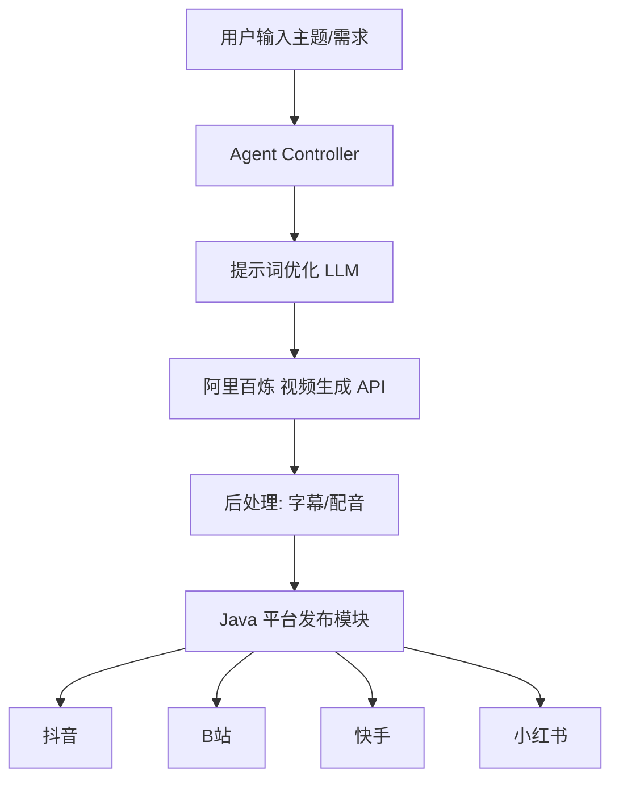

# 动漫短视频智能生产系统架构设计（简化版）

## 1. 系统架构图



## 2. 核心设计原则

### 简化原则
- ✅ **优先用现成 API**：不自己造轮子，直接调用阿里百炼
- ✅ **MVP 思维**：先跑通最小流程，再迭代优化
- ✅ **螺旋上升**：每个阶段都有可用产出

### 技术栈精简

| 模块 | 技术选型 | 说明 |
|------|---------|------|
| **视频生成** | 阿里百炼 API | 已购买，优先使用 |
| **LLM 提示词优化** | 通义千问 / GPT-4o | 百炼平台自带 |
| **配音** | 阿里云 TTS / Edge TTS | 免费 |
| **字幕** | FFmpeg | 开源 |
| **发布调度** | Java Spring Boot | 多平台适配 |
| **Agent** | 简单状态机 | 先不做复杂 ReAct |

---

## 3. 阿里百炼视频生成对接

### 3.1 百炼平台能力确认

**你需要确认的事项**：
1. 登录百炼控制台：https://bailian.console.aliyun.com
2. 查看「模型市场」是否有视频生成模型
3. 确认是否包含在你的套餐内

**百炼平台可能包含的视频能力**：
- 通义万象（视频生成）
- 通义千问（提示词优化）
- 语音合成 TTS

### 3.2 API 调用方式

```python
# 阿里百炼视频生成
import dashscope
from dashscope import VideoSynthesis

dashscope.api_key = "your-bailian-api-key"

# 文生视频
response = VideoSynthesis.call(
    model="wanx-v1",  # 或百炼平台实际模型名
    prompt="动漫风格的少女在樱花树下跳舞，优雅的动作，粉色花瓣飘落",
    duration=5,
    resolution="1080p"
)

video_url = response.output.video_url
print(f"视频已生成: {video_url}")
```

### 3.3 提示词优化模板

```python
ANIME_PROMPT_TEMPLATE = """
{user_input}

风格要求：日系动漫风格，色彩鲜艳，线条流畅
画面要求：高清，流畅动画，电影级光影
动作要求：{motion_style}

负面提示词：模糊, 低质量, 变形, 卡顿
"""

def optimize_prompt(user_input: str, motion: str = "优雅自然") -> str:
    return ANIME_PROMPT_TEMPLATE.format(
        user_input=user_input,
        motion_style=motion
    )
```

---

## 4. 简化后的工作流程

```
┌─────────────────────────────────────────────────────────┐
│                     用户输入                             │
│           "生成一个动漫少女跳舞的视频"                    │
└─────────────────────────────────────────────────────────┘
                         │
                         ▼
┌─────────────────────────────────────────────────────────┐
│                  提示词优化 (LLM)                        │
│   输入: "动漫少女跳舞"                                   │
│   输出: "日系动漫风格少女在樱花树下优雅跳舞..."           │
└─────────────────────────────────────────────────────────┘
                         │
                         ▼
┌─────────────────────────────────────────────────────────┐
│              阿里百炼 视频生成 API                       │
│   输入: 优化后的提示词                                   │
│   输出: 视频 URL                                        │
└─────────────────────────────────────────────────────────┘
                         │
                         ▼
┌─────────────────────────────────────────────────────────┐
│                    后处理 (可选)                         │
│   - 添加字幕 (FFmpeg)                                   │
│   - 添加配音 (Edge TTS)                                 │
└─────────────────────────────────────────────────────────┘
                         │
                         ▼
┌─────────────────────────────────────────────────────────┐
│                   平台发布 (Java)                        │
│   - 抖音 / B站 / 快手 / 小红书                          │
└─────────────────────────────────────────────────────────┘
```

---

## 5. Phase 1 MVP 实施计划（1 周）

### Day 1-2: 环境准备
- [ ] 确认百炼平台视频生成能力
- [ ] 获取 API Key
- [ ] 测试 API 调用

### Day 3-4: 视频生成 Pipeline
- [ ] Python 脚本：调用百炼 API
- [ ] 提示词优化模板
- [ ] 视频下载保存

### Day 5-7: 平台发布
- [ ] Java 项目初始化
- [ ] 抖音发布适配器
- [ ] 端到端测试

### 交付物
- 可运行的命令行工具：输入主题 → 生成视频 → 发布
- 基础文档

---

## 6. 后续迭代计划

### Phase 2: 功能增强（2 周）
- 多平台发布（B站、快手、小红书）
- 批量生产
- 定时发布

### Phase 3: 智能化（4 周）
- Agent 自动规划
- 多厂商切换（备选 Runway）
- 数据分析与优化

### Phase 4: 生产级（4 周）
- Web 管理界面
- 高可用部署
- 监控告警

---

## 7. 备选厂商（如果百炼不支持视频生成）

| 优先级 | 厂商 | 原因 |
|:------:|------|------|
| 1 | 阿里云视频 AI | 同生态，可复用账号 |
| 2 | Runway | API 成熟，动漫风格好 |
| 3 | 火山引擎 | 抖音生态 |

---

## 8. 下一步行动

1. **立即**：确认百炼平台是否包含视频生成
2. **如果包含**：直接对接百炼 API
3. **如果不包含**：切换到阿里云视频 AI 或 Runway

需要我帮你写百炼 API 的对接代码吗？