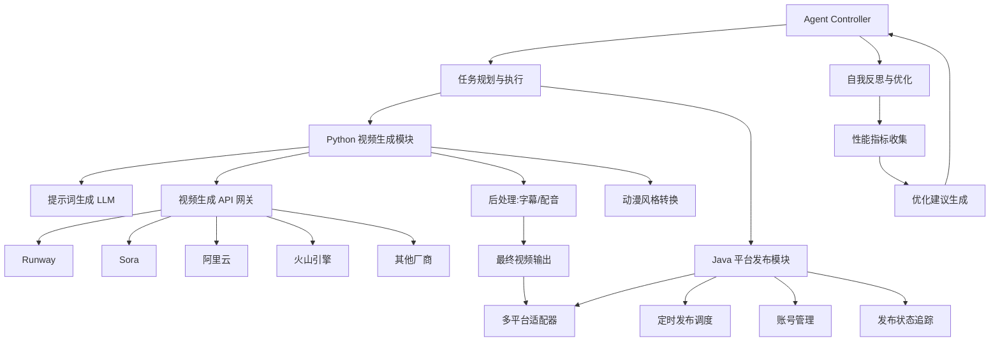

# 动漫短视频智能生产系统架构设计

## 1. 系统架构图



## 2. 视频生成厂商对比

### 2.1 厂商能力矩阵

| 厂商 | 动漫风格 | 视频时长 | 分辨率 | API 可用性 | 价格 | 推荐指数 |
|------|:--------:|:--------:|:------:|:----------:|:----:|:--------:|
| **Runway Gen-3** | ⭐⭐⭐⭐ | 最长 10s | 1080p | ✅ 开放 | $0.05/秒 | ⭐⭐⭐⭐⭐ |
| **OpenAI Sora** | ⭐⭐⭐ | 最长 60s | 1080p | ✅ 开放 | $200/月 | ⭐⭐⭐⭐ |
| **Pika 2.0** | ⭐⭐⭐⭐⭐ | 最长 5s | 1080p | ⚠️ 限开放 | 按量计费 | ⭐⭐⭐⭐ |
| **Google Veo 2** | ⭐⭐⭐ | 最长 60s | 4K | ⚠️ 限开放 | 企业定价 | ⭐⭐⭐ |
| **阿里云 通义万象** | ⭐⭐⭐ | 最长 10s | 1080p | ✅ 开放 | 按量计费 | ⭐⭐⭐⭐ |
| **火山引擎** | ⭐⭐⭐ | 最长 15s | 1080p | ✅ 开放 | 按量计费 | ⭐⭐⭐⭐ |
| **腾讯 混元** | ⭐⭐⭐ | 最长 10s | 1080p | ⚠️ 内测 | 待定 | ⭐⭐⭐ |
| **快手 可灵** | ⭐⭐⭐⭐ | 最长 30s | 1080p | ⚠️ 内测 | 待定 | ⭐⭐⭐ |

### 2.2 详细优缺点分析

#### Runway Gen-3（推荐首选）

**优点**：
- ✅ API 成熟稳定，文档完善
- ✅ 动漫风格支持好
- ✅ 风格控制精细（支持 LoRA）
- ✅ 支持图生视频、视频生视频

**缺点**：
- ❌ 价格较高（$0.05/秒）
- ❌ 国内网络需要代理
- ❌ 单次最长 10 秒

**适用场景**：高质量动漫短视频、商业项目

**对接方案**：见 [docs/vendors/runway.md](./vendors/runway.md)

---

#### OpenAI Sora

**优点**：
- ✅ 视频质量顶尖
- ✅ 支持最长 60 秒
- ✅ 与 GPT-4o 生态打通

**缺点**：
- ❌ 需要 ChatGPT Pro（$200/月）
- ❌ 动漫风格支持有限
- ❌ 国内访问受限

**适用场景**：高质量真人视频、创意短片

**对接方案**：见 [docs/vendors/openai-sora.md](./vendors/openai-sora.md)

---

#### Pika 2.0

**优点**：
- ✅ 动漫风格最佳
- ✅ 操作简单
- ✅ 支持风格迁移

**缺点**：
- ❌ API 开放程度有限
- ❌ 单次最长 5 秒
- ❌ 需要拼接成长视频

**适用场景**：二次元、动漫风格短视频

**对接方案**：见 [docs/vendors/pika.md](./vendors/pika.md)

---

#### 阿里云 通义万象（国内推荐）

**优点**：
- ✅ 国内网络稳定
- ✅ 价格便宜
- ✅ 与阿里云生态打通
- ✅ 支持中文提示词

**缺点**：
- ❌ 动漫风格质量一般
- ❌ 功能相对基础
- ❌ 单次时长较短

**适用场景**：国内项目、成本敏感、快速验证

**对接方案**：见 [docs/vendors/alibaba.md](./vendors/alibaba.md)

---

#### 火山引擎（抖音生态推荐）

**优点**：
- ✅ 与抖音生态深度绑定
- ✅ 国内网络稳定
- ✅ 提供完整视频处理链路
- ✅ 支持短视频模板

**缺点**：
- ❌ 动漫风格有限
- ❌ 需要企业认证
- ❌ 文档相对复杂

**适用场景**：抖音短视频、MCN 机构

**对接方案**：见 [docs/vendors/volcengine.md](./vendors/volcengine.md)

---

### 2.3 厂商选择建议

| 场景 | 推荐厂商 | 原因 |
|------|---------|------|
| **高质量动漫短视频** | Runway | 动漫风格最佳，API 成熟 |
| **成本敏感 + 国内** | 阿里云 | 便宜、稳定、中文支持 |
| **抖音生态** | 火山引擎 | 深度绑定，模板丰富 |
| **长视频创作** | Sora | 支持 60 秒 |
| **二次元风格** | Pika | 动漫风格最佳 |

### 2.4 多厂商组合策略

**推荐组合**：
1. **主力**：Runway（高质量动漫）
2. **备选**：阿里云（国内降级方案）
3. **特殊需求**：Sora（长视频）、Pika（二次元风格）

**实现方式**：
- 统一的视频生成 API 网关
- 根据提示词自动选择最优厂商
- 失败自动切换备选厂商

## 3. 技术栈选型

### Python 视频生成模块
- **核心语言**: Python 3.9+
- **API 网关**: 统一封装各厂商 API
- **LLM 集成**: GPT-4o / 通义千问（提示词优化）
- **后处理**: FFmpeg + MoviePy
- **配音**: Edge TTS / Azure TTS
- **异步处理**: Celery + Redis

### Java 平台发布模块
- **核心语言**: Java 17+
- **Web 框架**: Spring Boot 3.x
- **调度框架**: Quartz Scheduler
- **数据存储**: PostgreSQL + Redis
- **消息队列**: RabbitMQ（可选）

### Agent 层
- **框架**: 自研 ReAct 模式
- **规划引擎**: LLM 任务分解
- **工具调用**: Function Calling

## 4. 模块划分

### 4.1 视频生成 API 网关

统一封装各厂商 API，提供一致的调用接口：

```python
# 统一接口
class VideoGenerator:
    def generate(self, prompt: str, style: str, duration: int) -> str:
        """生成视频，返回视频 URL"""
        pass

# 各厂商实现
class RunwayGenerator(VideoGenerator): ...
class SoraGenerator(VideoGenerator): ...
class AlibabaGenerator(VideoGenerator): ...
```

### 4.2 提示词优化器

```python
class PromptOptimizer:
    def optimize(self, user_input: str, style: str) -> str:
        """优化提示词，提升生成质量"""
        # 根据厂商特性调整提示词
        # 添加风格关键词
        # 添加质量提升词
        pass
```

### 4.3 后处理模块

```python
class PostProcessor:
    def add_subtitles(self, video_path: str, text: str) -> str: ...
    def add_voiceover(self, video_path: str, audio_path: str) -> str: ...
    def apply_style(self, video_path: str, style: str) -> str: ...
    def concat_videos(self, video_paths: List[str]) -> str: ...
```

## 5. 分阶段实施计划

### Phase 1: 单厂商 MVP（2周）
- 接入 Runway API
- 基础提示词优化
- 简单后处理（字幕）
- 抖音单平台发布

### Phase 2: 多厂商支持（4周）
- 接入阿里云、火山引擎
- API 网关统一封装
- 自动厂商选择
- 多平台发布

### Phase 3: 智能化增强（6周）
- ReAct Agent 实现
- 自动提示词优化
- 风格一致性控制
- 批量生产

### Phase 4: 生产级优化（4周）
- 高可用架构
- 成本优化
- 监控告警
- 安全加固

## 6. 厂商对接方案目录

详细的厂商对接方案见子目录：

- [Runway 对接方案](./vendors/runway.md)
- [OpenAI Sora 对接方案](./vendors/openai-sora.md)
- [Pika 对接方案](./vendors/pika.md)
- [阿里云对接方案](./vendors/alibaba.md)
- [火山引擎对接方案](./vendors/volcengine.md)
- [腾讯混元对接方案](./vendors/tencent.md)

---

## 参考资源

- [视频平台趋势分析](./video-platform-trends.md)
- [AI 视频创作项目分析](./ai-video-creator-analysis.md)
- [厂商能力对比](./ai-video-vendors.md)